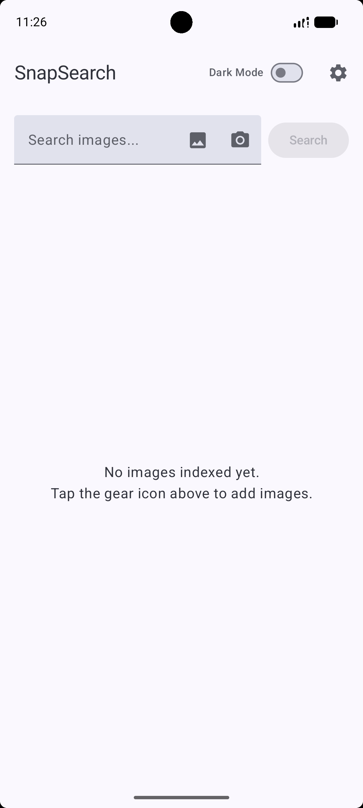
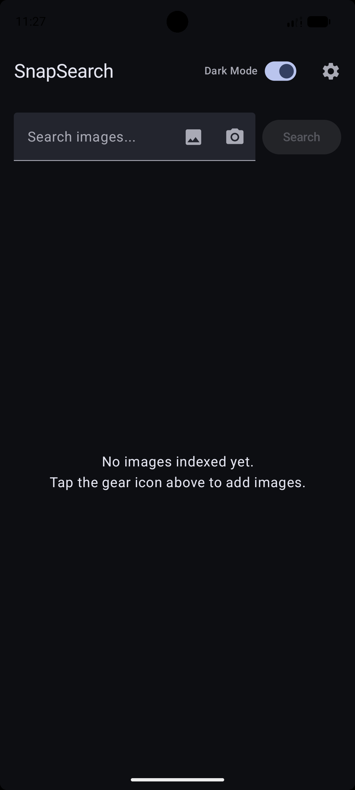
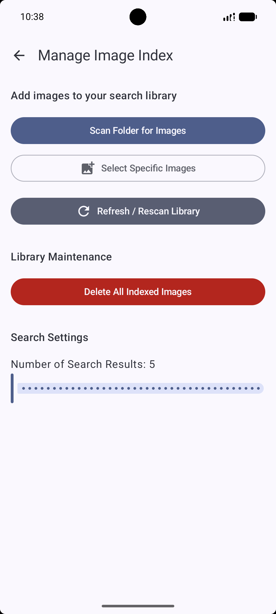
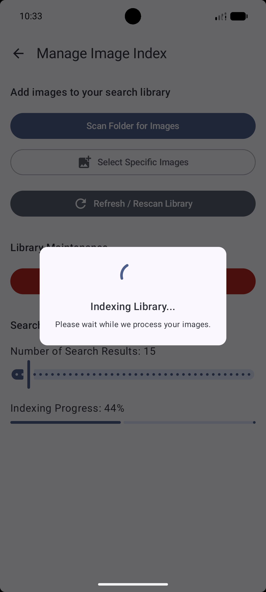
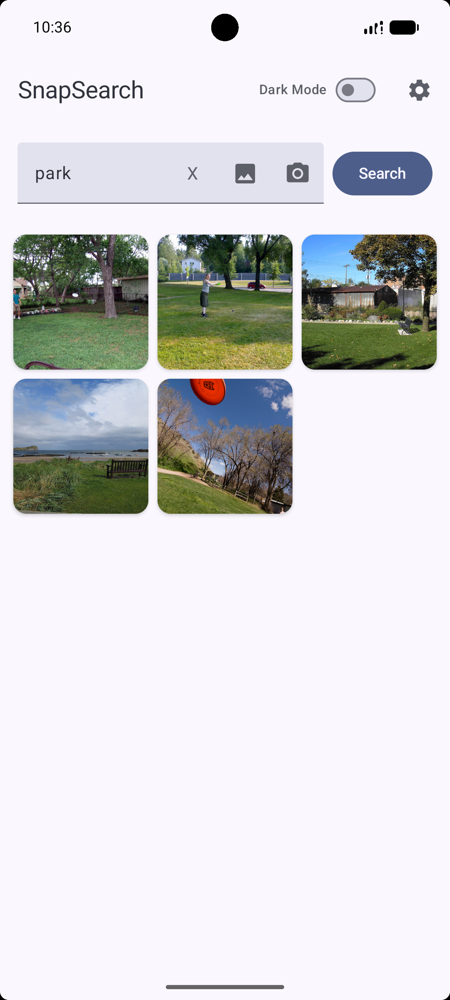
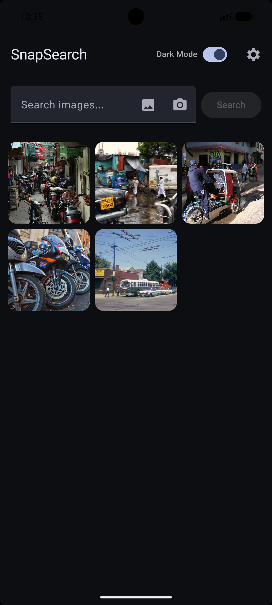

# SnapSearch 📸

**SnapSearch** is an offline Android application for semantic image retrieval. It enables users to search their local photo library using either natural language or another image, with all processing performed entirely on-device.

Built with **Jetpack Compose**, **ONNX Runtime Mobile**, and modern Android components, SnapSearch delivers fast, private, and server-free image retrieval.

> **Note**
>
> This repository contains only the Android application. The model training pipeline and desktop implementation are maintained in separate repositories.

---

## 🎥 Demo


> The demo uses images from the **COCO 2017 Validation** dataset.

---

## 📥 Download

Download **SnapSearch-v1.0.0-beta.apk** from the **[Releases](https://github.com/Ashish-C01/SnapSearch/releases/latest)** page.

## ✨ Features

- 🔍 **Text-to-Image Search**
  - Search your photo library using natural language.
  - Example queries:
    - *"park"*
    - *"people sitting at a table"*

- 🖼️ **Image-to-Image Search**
  - Capture a photo or choose one from your gallery to retrieve visually similar images.

- 🔒 **100% Offline & Private**
  - No internet connection required.
  - No cloud processing.
  - Images and search queries never leave your device.

- ⚡ **Efficient On-Device Retrieval**
  - Image embeddings are stored locally in a compact binary index.
  - Metadata is managed using Room Database.
  - Cosine similarity is used for semantic search.

- 📂 **Library Management**
  - Index one or more folders.
  - Duplicate image detection using SHA-256 hashing.
  - Re-index folders after adding new images.

- 🌙 **Modern Android UI**
  - Jetpack Compose
  - Material 3
  - Dark Mode support

---
## 🧠 Models

SnapSearch uses lightweight distilled models optimized for on-device inference:

- **Image Encoder:** MobileCLIP-S2 based image encoder (512-dimensional embeddings)
- **Text Encoder:** MiniLM-L6-v2 based text encoder (512-dimensional embeddings)
- **Inference Engine:** ONNX Runtime Mobile

---

# Screenshots

## Home Screen



## Index Images




## Text Search


## Image Search


---
# Application Architecture

```
Text/Image Query
        │
        ▼
ONNX Runtime Mobile
        │
        ▼
512-D Query Embedding
        │
        ▼
Cosine Similarity Search
        │
        ▼
Ranked Results
```

### Indexing Pipeline

```
Selected Images
        │
        ▼
 Image Encoder (ONNX)
        │
        ▼
 512-D Embeddings
        │
        ▼
 Binary Embedding File
        │
        ▼
Room Metadata Database
```

---

# Technology Stack

- Kotlin
- Jetpack Compose
- Material 3
- Android Jetpack
- ONNX Runtime Mobile
- Room Database
- SQLite
- Binary Embedding Storage

---

# Installation

1. Download the latest APK from the **Releases** page.
2. Install the APK on your Android device.
3. Allow installation from unknown sources if prompted.
4. Launch **SnapSearch**.
5. Open **Settings** and index one or more folders.

---

# Usage

### Index Images

1. Open **Settings**.
2. Select one or more folders containing images.
3. Wait for indexing to complete.

### Text Search

Enter a natural language query such as:

- "dog playing in the park"
- "red flower"
- "sunset over mountains"

The application retrieves the most semantically relevant images from your indexed library.

### Image Search

1. Capture a photo or select one from your gallery.
2. SnapSearch generates an embedding for the query image.
3. Similar images are retrieved from your indexed collection.


---

# Related Repositories

This application is part of a larger image retrieval project.

| Repository | Description |
|------------|-------------|
| **Android Application** | This repository |
| **Model Training** | [Training pipeline, knowledge distillation, evaluation, and ONNX model export](https://github.com/Ashish-C01/SnapSearch-Models) |
| **Desktop Application**  | [Cross-platform desktop application built with Kivy](https://github.com/Ashish-C01/SnapSearch-Desktop) |

---

# Acknowledgements

This project makes use of several excellent open-source technologies:

- ONNX Runtime
- Jetpack Compose
- Android Room Database
- Kotlin Coroutines

---

# License

This project is licensed under the MIT License. See the `LICENSE` file for details.
